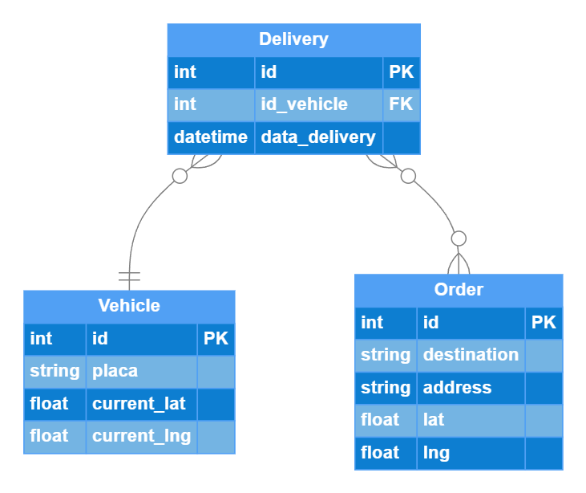

# Teste Desenvolvedor .NET

Neste teste serão avaliados seus conhecimentos e a metodologia aplicada no desenvolvimento de uma aplicação .NET.

## O Desafio

O desafio é criar um servidor que provê uma API com o objetivo de fornecer informações sobre o entrega de um produto (Delivery)

## Requisitos

Esses requisitos são obrigatórios e devem ser desenvolvidos para a entrega do teste

### CRUD

Implementar as operações de **criação (POST)**, **consulta (GET)** (Por Id e GetAll), **atualização (PUT)** e **exclusão (DELETE)** de todas as entidades do seguinte diagrama:

